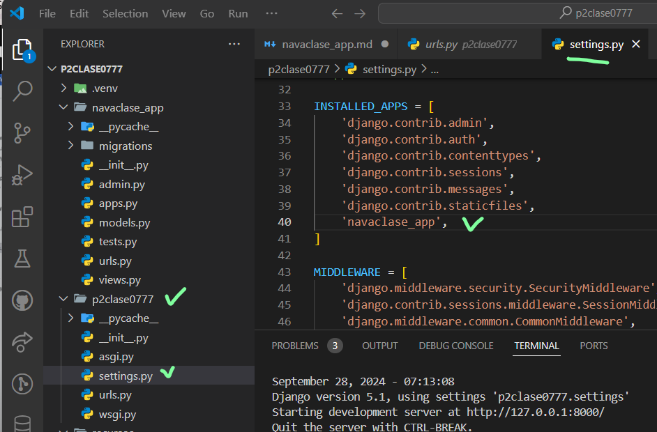

- Creamos el archivo urls.py en navaclase_app
- 
- En setting.py de p2clase0777
- 
- En urls.py de p2clase007
- 
- 
- en urls.py en navaclase_app
- 
- 
- en views.py en navaclase_app  min 32.42
- 
-  en urls.py en navaclase_app
- 
- ejecutamos el servidor si no esta trabajando
- 
- en views.py en navaclase_app
- 
- en urls.py en navaclase_app
- 
- En el navegador
- 
- creamos ruta dinamica 
- en views.py en navaclase_app
- 
- en urls.py en navaclase_app
- 
- En el navegador
- 
## creamos carpeta templates y subcarpeta navaclase_app + index.html
- 
- en views.py en navaclase_app actualizamos
- 
- 
- En el navegador
- 
- 
- 