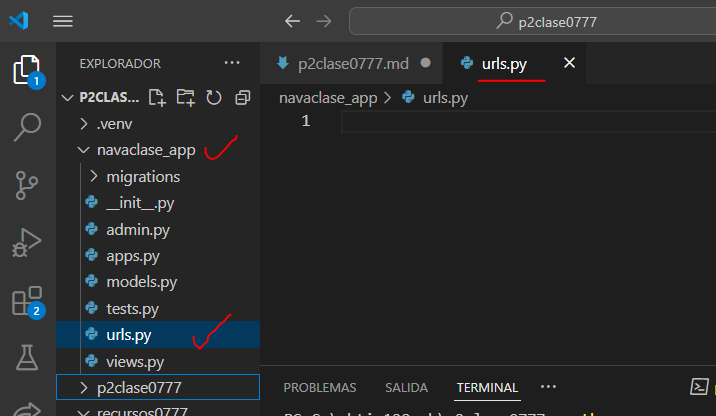
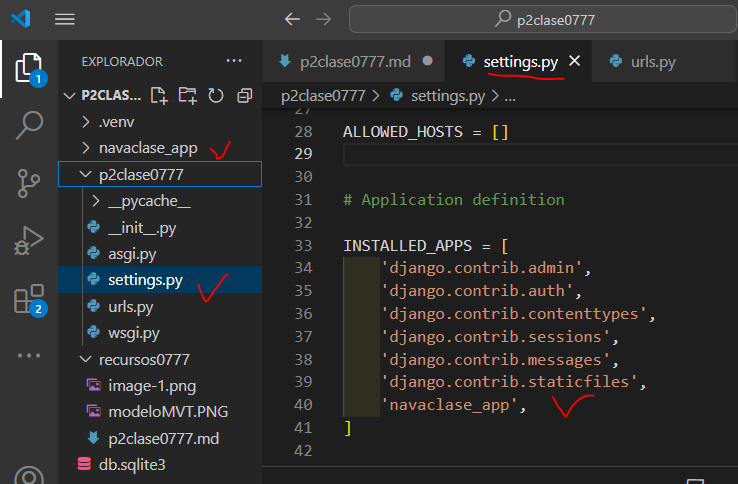
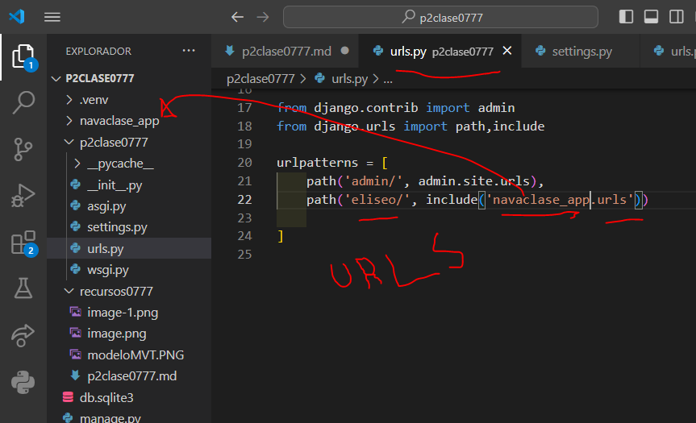
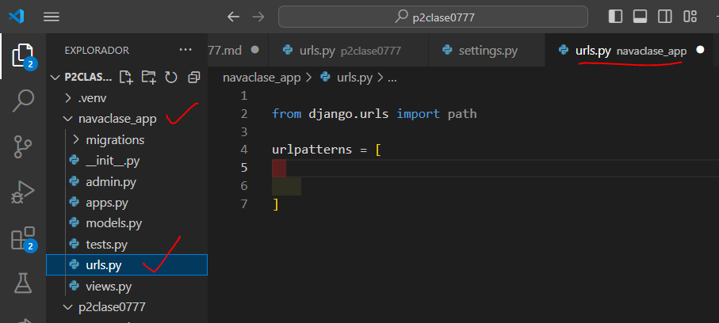
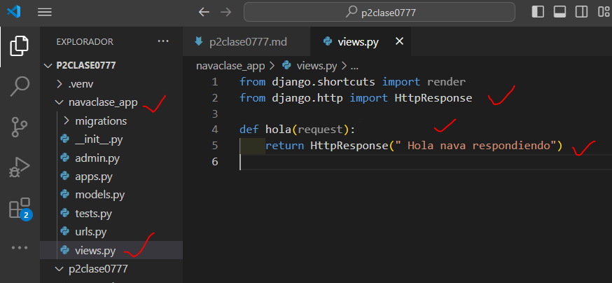
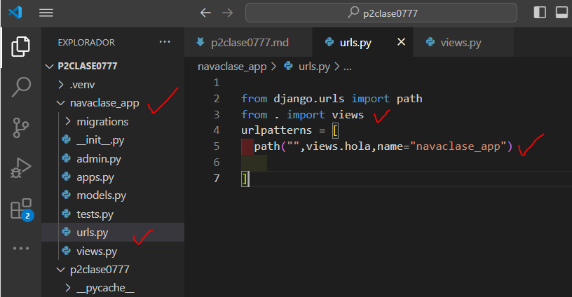

- Crear aplicacion navaclase_app
- comando --> python manage.py startapp navaclase_app
- Creamos el archivo urls.py en navaclase_app
- 
- En setting.py de p2clase0777
- 
- En urls.py de p2clase007
- 
- en urls.py en navaclase_app
- 
- en views.py en navaclase_app
- 
- en urls.py en navaclase_app
- 