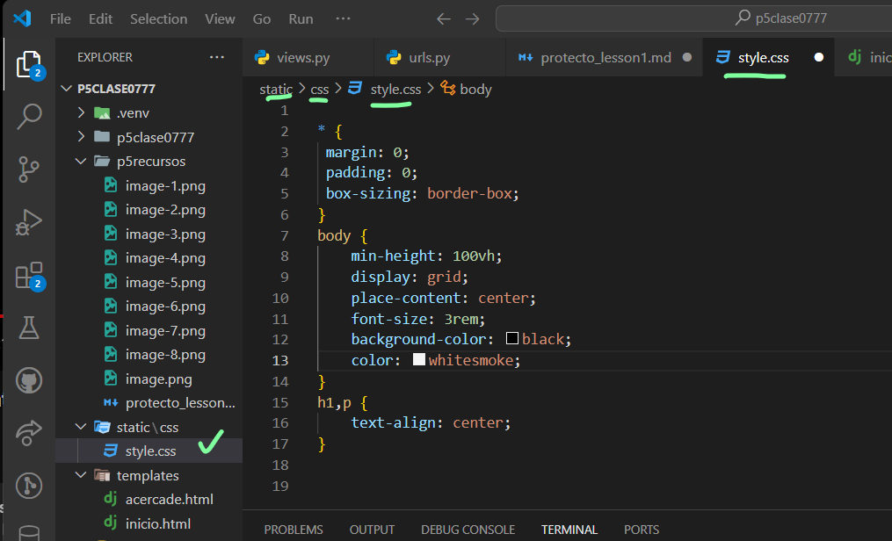

- Creamos el archivo views.py en p5clase077   https://youtu.be/qcJZN1pvG6A?si=xUT8IMxqEluJpYuu
- 
-
- en urls.py en  p5clase0777
- 
- 
- ejacutamos el servidor
- 
- 
- creamos la carpeta templates y el archivo inicio.html
- 
- 
- dentro de la carpeta el archivo acercade.html
- 
- 
- En settings.py
- 
- en el archivo views.py 
- 
- 
- en el navegador
- 
- 
- Creamos la carpeta static y a su vez la carpeta css
- mas  el archivo style.css
- 
- 
- en setting.py realizamos lo siguiente
- 
- mas
- 
- 
- en archivo inicio.html
- 
- 
- ejecutamos el servidor
- 
- en el archivo acercade.html
-  